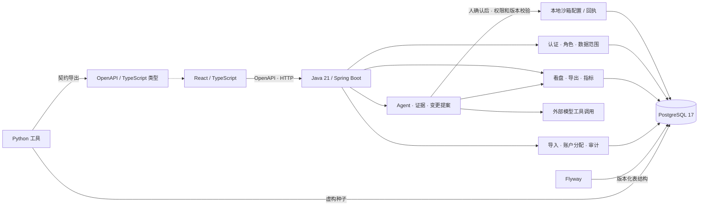

# IAA 运营 Agent 工作台

一个面向 FDE 求职展示的「运营 IDE」：左侧观察原始投放数据，右侧用自然语言交给 Agent 查询、分析和准备出价 / 预算调整。人决定目标和是否执行，Agent 提供意见、准备具体修改，并在确认后干活。

[](https://github.com/xmhuangzhijun-hue/iaa-ops-platform/actions/workflows/ci.yml)

**早期开源作品集 · MIT。** 当前主线在 `v1.0.0-rc.1` 中台基础上新增 Agent 工作台。完整前后端和数据库可本机运行；业务数据全部虚构，模型调用真实，确认后的预算 / 出价修改只写本地 PostgreSQL 沙箱，未连接媒体平台、未部署公网服务、没有真实客户成效声明。

先看 [Agent 演示与配置](docs/agent/demo.md)、[设计说明](docs/agent/design.md)、[实际验收](reports/agent-acceptance.md)。[原中台演示](docs/demo-guide.md)保留作为数据复核路径；完整进度见 [项目状态](docs/STATUS.md)。

## 一句话能做什么

1. 「按账户复盘最近七天的消耗和 ROI，告诉我优先排查哪里，先不调整。」→ 调用授权报表，给出建议及可展开的来源。
2. 选中计划后说「日预算改为 1200 元，出价不变。」→ 读取当前配置，显示逐字段修改前后值。
3. 点击确认 → 重新检查权限、版本和有效期，事务写入沙箱，返回可复核回执；点击拒绝则不改配置。

模型没有可直接执行预算修改的工具。租户、用户、数据范围和字段权限由 Java 强制；运行历史、证据和回执只属于发起人。只读账号可以分析其可见数据，不能获得执行权限。

这是一个可复演的 FDE 设计样本：把业务动作接到数据、授权、审阅、执行和验证，而不只提供聊天框。读者可查看 [需求 / 验收矩阵](docs/agent/requirements.md)、[架构取舍](docs/adr/0005-agent-workbench.md)、[四个上游项目的借鉴与边界](docs/agent/references.md)。

## 已有业务基础

| 能力 | 可体验内容 |
|---|---|
| 登录与权限 | 访问令牌、轮换刷新令牌、临时口令首次改密、账号/IP 登录失败锁定、角色和数据范围 |
| 看盘分析 | 聚合看盘、分天明细、趋势图、ROI 异常清单、原始明细；筛选、分组、分页与 CSV 导出 |
| 数据导入 | `.xlsx` 上传、后台处理、覆盖日期与写入/替换行数、坏行定位、终态结果 |
| 系统管理 | 用户与权限、账户分配、审计日志、指标与字段说明 |
| 使用偏好 | 账号级主题、列设置、并发修改版本检查 |

默认导航收敛到「运营工作台」、原始明细和必要系统管理，其余原有报表路由仍可用于复核。工作台的原始数据 / 沙箱计划 / 回执与右侧助手并排；无真实收益权限的账号只显示允许的汇总字段。早期产品、品类、媒体账户等原型和占位页不开放。**媒体 API 采集尚未实现**；当前数据入口是虚构种子和 Excel 导入。

Java 业务后端已实现契约中的 31 个操作（原有 24 个 + Agent 7 个）。Python 保留契约模型、演示种子和迁移对照服务；其中 8 个管理操作仍返回 `501`，Agent 没有 Python 业务实现。前端默认连接 Java。

## 技术栈

| 层 | 实际使用 |
|---|---|
| 前端 | React 18、TypeScript、Vite、Ant Design、Tailwind CSS |
| 表格与图表 | AG Grid Community、ECharts |
| API | openapi-fetch、TanStack Query、由 OpenAPI 生成的 TypeScript 类型 |
| 回答排版 | react-markdown、remark-gfm；表格 / 列表 / 代码块，来源与变更卡独立展示 |
| Agent | Java 有界工具循环；JDK HttpClient 连接兼容 Chat Completions 的工具调用接口；真实验证使用 DeepSeek |
| 业务后端 | Java 21、Spring Boot 4.1、Spring Security、JPA/JDBC |
| 数据库 | PostgreSQL 17；Flyway 管理表结构，运行时校验实体 |
| 迁移与数据工具 | Python 3.12+、FastAPI/Pydantic、SQLAlchemy；Alembic 冻结为历史基线 |
| 验证 | JUnit / Testcontainers / ArchUnit、pytest、双后端对照、GitHub Actions |
| 构建与开发环境 | Gradle Wrapper、uv.lock、pnpm 锁文件；Docker Compose 启动 PostgreSQL |



Python 的迁移对照服务仅供测试；实际业务入口是 Java。Redis、消息队列、独立采集 Worker 未实现，均不属于启动依赖。

架构取舍见 [ADR-0004](docs/adr/0004-backend-stack.md)。`facts` 模块、Redis、队列和媒体采集留待真实需求触发，见 [facts 前置审计](docs/design/facts-module-split.md)。

## 从空库启动本地演示

需要 Docker、JDK 21、Python 3.12+/uv、Node.js 24 和 `web/package.json` 指定版本的 pnpm。Gradle 使用仓库 Wrapper。以下命令在仓库目录执行；Java 与前端分别保持一个终端运行。

先获取源码：

```sh
git clone https://github.com/xmhuangzhijun-hue/iaa-ops-platform.git
cd iaa-ops-platform
```

1. 启动本机数据库并准备 Python 工具。

```sh
docker compose up -d postgres
cd backend
uv sync --locked
cd ..
```

2. 启动 Java。Flyway 会在空库执行 V1、V2、V3 迁移；新建演示库无需先跑 Alembic。需要真实 Agent 时，先按 [模型配置](docs/agent/demo.md#模型配置)向 Java 进程注入环境变量；不配置时数据看盘仍可用，助手明确显示未配置。

Windows PowerShell：

```powershell
cd backend-java
.\gradlew.bat bootRun
```

Linux/macOS：

```sh
cd backend-java
chmod +x gradlew
./gradlew bootRun
```

健康检查：[http://127.0.0.1:8080/api/v1/health](http://127.0.0.1:8080/api/v1/health)。默认数据库地址为 `127.0.0.1:55433/iaa_ops`，用户 `iaa`。Compose 的免密配置仅绑定本机，用于虚构演示库。

3. Java 启动成功后，在另一终端从仓库根目录灌入演示数据，然后启动前端。

```sh
cd backend
uv run python -m app.demo.seed --days 60
uv run python -m app.demo.agent_seed
cd ../web
pnpm install --frozen-lockfile
pnpm dev --host 127.0.0.1
```

`app.demo.seed` 只用于空演示库，会重建 `tenant_demo` 核心数据；已有 Agent 记录会形成外键引用，不要将它当作日常启动命令重复执行。`app.demo.agent_seed` 仅补缺失的 36 条虚构计划控制配置，可重复运行且保留历史修改。默认生成截至昨天的 60 天事实；演示时选择最近 7 天，今日为空属于正常情况。

打开 [本机演示](http://127.0.0.1:5173)。`/api` 默认代理到 Java 8080；用 `SERVER_PORT` 改 Java 端口时，同时用 `VITE_API_TARGET` 指定前端代理目标。根目录 `.env` 仅由 Compose 读取，不会自动注入 Java/Python；修改 `IAA_PG_PORT` 后须分别设置两种数据库 URL。各进程的环境变量独立设置；Python 的 `DATABASE_URL` 使用 `postgresql+psycopg://`，Java 使用 `jdbc:postgresql://`，不能混用。

本机虚构演示账号统一口令：`iaa-demo-2026`。

| 账号 | 演示用途 |
|---|---|
| `demo.admin` | 全流程管理与真实口径看盘 |
| `demo.company` | 公司管理员、账户分配与导入 |
| `demo.operator` | 仅“运营甲”范围内的真实口径看盘 |
| `demo.agency` | 仅“星河代理”范围；不显示变现收益和 ROI 等真实收益指标 |
| `demo.readonly` | 只读看盘；没有业务管理写权限和真实收益指标 |

公开演示不得照搬这组管理账号，须完成[只读部署与发布检查](docs/release-checklist.md)。

## 数据导入规则

- 读取 `.xlsx` 的第一个工作表，首行是表头；必需列为“日期、账户、消耗”。可选列有小时、推广计划、预估收益、曝光、点击、启动数、回传数、转化数。
- **按租户、媒体、日期整体替换**：成功解析的数据覆盖哪几天，就替换这些天该媒体的全部事实数据，并非只替换文件出现的账户。重复导入同一天不会累加。
- 单行出错跳过并记录行号、列名；没有有效行则任务失败。文件上限 10MB。
- 上传返回 `202` 和任务 ID，页面轮询到终态后停止。导入结果和审计记录均来自真实后端。

安全演示日期和可复制样表见 [导入演示](docs/demo-guide.md#导入演示)。

## 验证与契约维护

Java 测试需要 Docker，Python 测试需要本机 PostgreSQL；两个测试套件使用各自的测试库。执行命令见 [发布清单](docs/release-checklist.md)。远端执行状态见页首 CI 徽章和 [Actions](https://github.com/xmhuangzhijun-hue/iaa-ops-platform/actions)，具体版本的结果以对应提交为准；本机验证记录见 [验收报告](reports/v1-demo-acceptance.md)。

`contracts/openapi.json` 描述当前 Java 服务。`backend/scripts/export_openapi.py` 暂时复用 FastAPI 模型，再按显式操作登记表标注 Java 实现；`x-reference-implementation` 保留 Python 实际状态。Python 自身 `/api/openapi.json` 仍诚实描述旧服务，导出不会修改它。契约源尚未迁移到 springdoc。

改接口时同时改 Java 实现、`backend/app` 中的契约模型/示例，以及导出器的操作登记，再生成：

```sh
cd backend
uv run python scripts/export_openapi.py
uv run python scripts/export_openapi.py --check
cd ../web
pnpm gen:api
pnpm build
```

模型、导出器、契约和生成类型一起提交。每个操作必须带 `x-requirements`；全量验收还需 Java 集成测试、对照检查与实际页面操作。

## 项目结构与边界

```text
backend-java/       当前业务实现：iam、reporting、mapping、governance、ingestion、agent
  src/main/resources/db/migration/  Flyway 表结构真值
  src/test/java/                    模块边界、接口与事务测试
backend/            Python 契约模型、种子和迁移对照服务
contracts/          生成的 Java OpenAPI 契约
web/                React 前端与生成的 API 类型
tools/parity/       同库双后端对照、Java 响应契约校验
tools/agent/        需明确启用的本机真实模型验证
docs/               演示指南、状态、发布清单、设计与决策记录
```

- 指标以 Java `shared/metrics` 为准；派生指标按汇总后的基础指标重算，零分母返回空。Python 保留迁移前原件用于对照。
- 角色、字段权限、租户与数据范围在服务端强制。授权维度 `null`/省略为不限，`[]` 为无授权值；报表筛选的空数组仅表示未额外筛选。
- 登录锁定目前是有界单机内存，重启清零、多实例不共享。默认不信任转发头；经代理时会共享代理 IP 的额度。公网入口限流和可信代理配置尚需部署验收。
- 导入使用应用进程内后台任务，未实现进程中断后的持久队列恢复；这版证明功能闭环，不宣称高可用或生产容量。

贡献流程见 [CONTRIBUTING](CONTRIBUTING.md)，安全问题见 [SECURITY](SECURITY.md)。

## License

[MIT](LICENSE)
