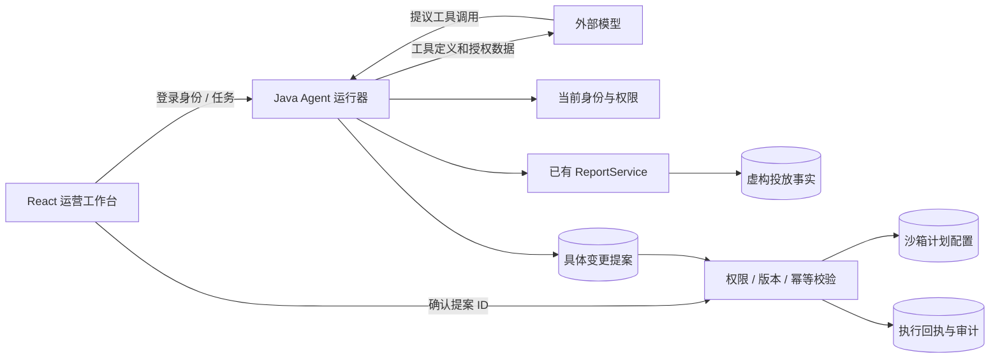

# 如何设计这个运营 Agent

这个作品的目标是让读者看见一条 FDE 交付链：业务问题 → 可用数据与权限 → 工具契约 → 用户审阅 → 执行回执 → 验证。虚构案例可以复演这条链，不能替代生产客户证据。

## 1. 用户与业务动作

运营仍然直接观察原始数据，助手位于右侧。用户可以选择计划后说：“把这条计划的日预算改为1200，出价不变。”也可以要求先分析，再决定是否改动。助手给建议不代表自动获得执行许可。

第一版关注两类任务：授权范围内的查询/分析，以及出价/预算的具体变更。任意自然语言都交给真实模型理解；没有“包含预算二字就执行某个固定脚本”的分支。

## 2. 分层与数据流



模型负责理解、调查、工具选择和解释。Java负责身份、可执行能力、数据查询、金额边界、版本一致性及数据库副作用。前端负责让人读懂数据、证据和即将发生的修改。模型服务密钥只存在服务端环境中。

模型循环有步数、时间与资源上限。返回工具调用时，运行器验证名称和参数、执行允许的工具，再把工具结果交回模型；结束时保存回答。未配置模型会显示不可用，不以模板回答伪装成功。

## 3. 权限如何贯穿全过程

身份来自登录令牌及当前数据库用户，不能来自提问里的“我是管理员”，也不能来自模型生成的 `user_id`。权限分为四个层次：

| 层次 | 强制点 |
|---|---|
| 租户 | 所有查询、计划、运行、提案和回执都限定当前租户 |
| 数据范围 | 代理、产品、运营三维交集；空授权数组无数据；请求筛选只能缩小范围 |
| 字段和操作 | `metrics.real` 控制收益字段，`agent.execute` 控制预算/出价修改 |
| 对象所有者 | 运行、证据、提案和回执属于发起人，不因同租户或管理员角色而共享私人对话 |

每次工具执行和批准都重新读取主体。审批先锁运行记录，再对当前用户和映射取共享锁，在同一事务里校验并执行；这覆盖等待期间撤权和执行中撤权两种时序。旧运行读取也校验当前授权，避免撤权后从历史结果继续取得数据。账户归属变化同样属于授权变化，不能只比较用户角色。查询无权目标不泄漏它是否存在。

前端菜单只改善体验。绕过页面、直接调用接口、伪造工具参数、切换账号读取旧链接，都必须由服务端拒绝。没有提供模型可直接执行的任意SQL或任意URL工具。

## 4. 数据来源与证据

当前事实数据来自固定种子或人工导入的Excel，计划控制数据由专用虚构种子生成。两者没有媒体线上同步；出价/预算调整也不会重写过去的消耗、收益或ROI。

查询证据展示来源、调用的工具、查询条件、数据时间和查询结果；服务器分配事件/证据编号，模型引用实际存在的成功结果。主表日期、筛选和关键词随任务传递；模型仍须正确使用这些参数。用户可展开结果查看数字，不能仅依靠模型文案验证事实。运行事件是工具执行记录，不是模型内部思维链。

数据缺失不等于零，相关变化不等于因果。助手需要区分观察到的数据、合理的调查建议与尚缺信息。当前事实表没有完整的“源文件→导入批次→单行”的血缘字段；不把查询快照或 `loaded_at` 宣称为已完成行级溯源。接入真实来源前应补批次/版本标识和保留策略。

用户输入、计划名称和查询结果均视作数据。它们不能改变系统指令或权限；即使出现“忽略此前要求”等文本，也没有绕过执行审批的代码通道。

## 5. 变更如何由人决定

操作分成准备和提交两段：

1. 读取当前可见计划及其版本。
2. 模型提出目标数值；服务器验证计划权限和金额范围，保存具体前后值。
3. 前端显示计划名、账户、预算/出价前后值和提案有效期。用户可以确认或拒绝。
4. 批准接口只接受提案标识与决定，不接受另带的一套修改数值。执行前重新检查授权、提案状态、到期时间和计划版本。
5. 在同一个本地事务内更新配置、保存审计与回执。重复批准返回既有结果；版本不符要求重新准备，不覆盖他人的修改。

这里的事务原子性只覆盖本地沙箱。未来媒体API执行必须处理远端超时后“实际已执行”的不确定性，先查回执再决定重试，不能照搬数据库事务假设。

## 6. 为什么这样排版

```text
┌ 导航 ┬ 原始数据 / 计划操作 / 操作回执 ┬ Agent 助手 ┐
│      │ 筛选条件                       │ 任务输入   │
│      │ 表格、选中计划                 │ 执行状态   │
│      │                               │ 结果与证据 │
│      │                               │ 修改前→后  │
│      │                               │ 确认 / 拒绝│
└──────┴───────────────────────────────┴────────────┘
```

- 主要空间留给数据；助手侧栏与当前工作对象相邻，避免在多个页面之间抄编号。
- 查询、建议、待确认和已执行使用不同状态，防止“建议已给出”被误解为“预算已改”。
- 操作使用逐字段差异而非一段确认文案；回执单独展示实际写入结果。
- 来源按需展开，正文先讲结论。显示真实工具事件，不播放假进度或虚构思考。
- 沿用已有主题、数值格式和表格组件，窄屏切换工作区和助手；权限不足时不挂载敏感查询。

回答使用成熟的 `react-markdown` + `remark-gfm`，表格可横向滚动、列表和代码有独立样式。原始 HTML 跳过，图片不作为远程资源加载，链接经过协议过滤；不自写 Markdown 解析器，也不让模型 HTML 直接进入页面。事实证据和执行差异由类型化组件呈现，不从回答正文解析执行参数。

## 7. 如何验证及如何讲述

确定性测试验证授权、版本、幂等、事务和失败状态；真实模型测试验证理解、工具选择与结果组织，两种证据分开记录。评测用例和实际结果见 [验收报告](../../reports/agent-acceptance.md)，不能把一次模型成功写成稳定成功率。实际试跑曾出现表格正确但正文最高值、回收差额排序错误；增加比较提示后仍发生，因此保留失败证据，不以提示词改动宣称问题已消失。

面试演示建议：先展示原始数据，再提出一个查询，展开证据；然后要求修改选中计划，展示确认前配置不变，批准后配置及回执一致；最后切到只读账号演示拒绝执行。解释一个失败案例及取舍，比堆叠框架名称更能让读者评估交付判断。

已知边界包括：虚构数据、仅本地沙箱执行、单实例运行器、没有真实客户成效、没有媒体凭据与生产投放。具体构建和模型实测结果应以本轮验收报告为准。

相关：[需求与验收](requirements.md) · [架构决策](../adr/0005-agent-workbench.md) · [开源参考](references.md)。
